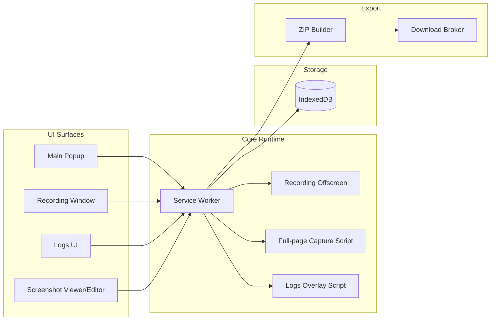
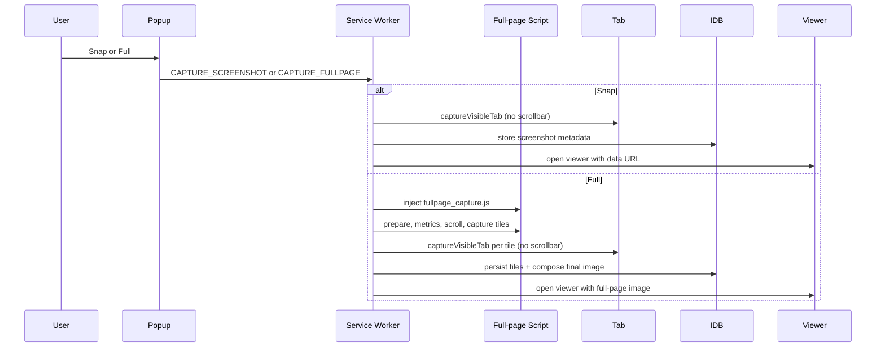
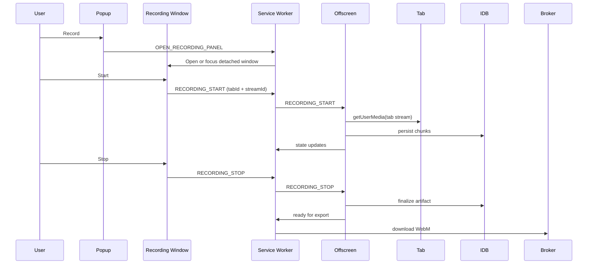
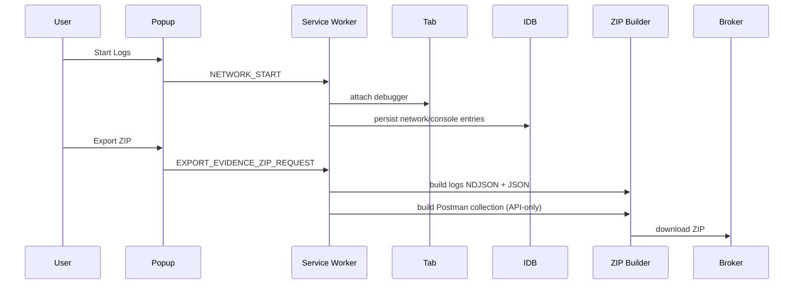
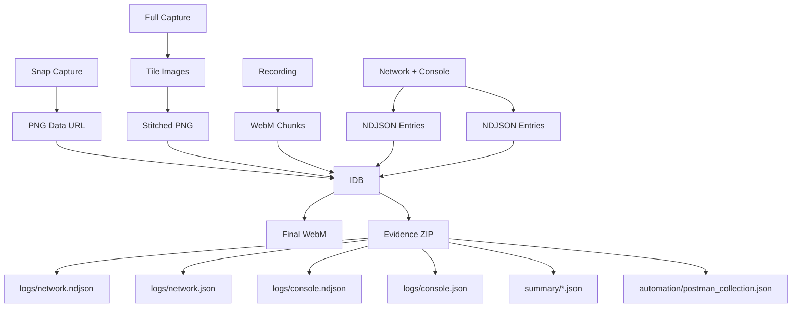
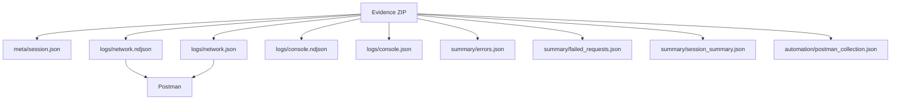

# Repro V1 Architecture

Repro is a local-only MV3 Chrome extension for QA capture and automation handoff.
It provides Snap and Full-page screenshots, tab recording, network/console logs,
and structured evidence export including a Postman collection.

This document contains multiple diagrams for engineering discussion and onboarding.

## System Context Diagram

```mermaid
graph TD
  User[User] --> Popup[Repro Popup UI]
  User --> RecWin[Recording Control Window]
  User --> Viewer[Screenshot Viewer/Editor]

  subgraph Chrome Extension (MV3)
    Popup --> SW[Service Worker]
    RecWin --> SW
    Viewer --> SW
    SW --> Offscreen[Offscreen Document]
    SW --> ContentScripts[Content Scripts]
    SW --> IDB[(IndexedDB)]
    SW --> Broker[Download Broker]
  end

  User --> Tab[Browser Tab]
  Tab --> WebApp[Target Web App]
  WebApp --> API[External APIs]

  ContentScripts --> Tab
  Offscreen --> Tab
  SW --> Tab

  IDB --> ZIP[Evidence ZIP]
  IDB --> WebM[Recording WebM]
  IDB --> PNG[Screenshots PNG]
  Broker --> ZIP
  Broker --> WebM
  Broker --> PNG
```

## Container / Component Diagram



## Sequence Diagram - Snap / Full Capture



## Sequence Diagram - Recording



## Sequence Diagram - Logs Capture



## Data Flow Diagram



## Export Artifact Diagram



## Architecture Assumptions

- Recording controls are detached into a dedicated popup window and are not
  injected into the captured tab DOM.
- Full-page capture uses a content script to scroll and compute tiles, but
  the final image is composed and exported in the service worker.
- Logs export uses IndexedDB as the durable source of truth; network.ndjson is
  the raw canonical log, while network.json is the readable structured view.
- The download broker mediates ZIP and WebM file downloads using local blobs.

## V1 Frozen / Stable Areas

- Screenshot capture and full-page stitching pipeline.
- Recording engine (offscreen capture, chunk persistence, export).
- Logs capture pipeline and IndexedDB persistence.
- ZIP export structure, NDJSON/JSON logs, and Postman collection export.

## Export / Automation Bridge Extensions

- Postman collection export (automation/postman_collection.json) is derived
  from network logs and is an export-only bridge, not a capture system.
- Summary files are derived from logs and do not affect capture pipelines.
