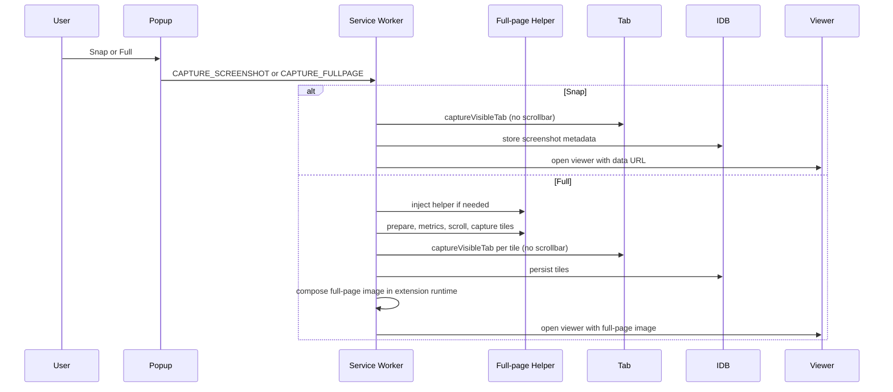
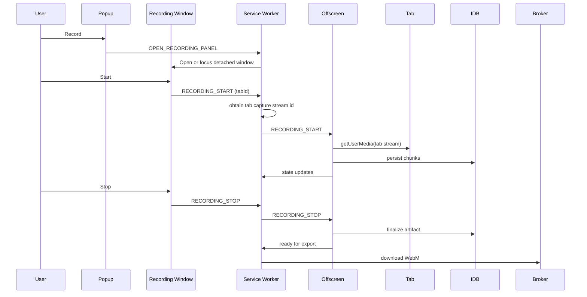
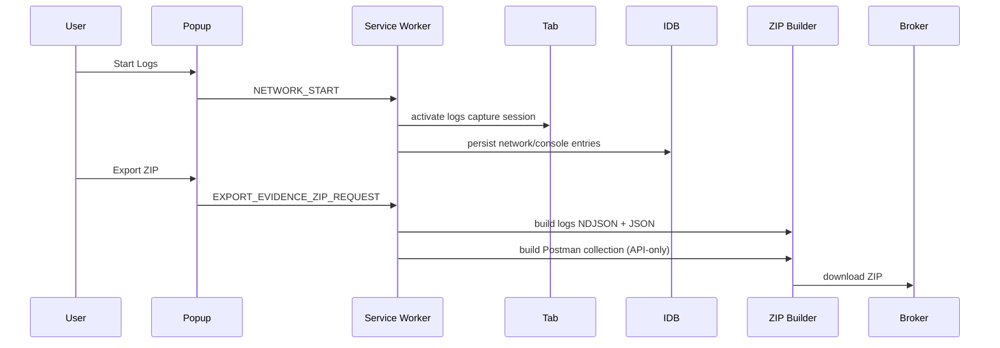
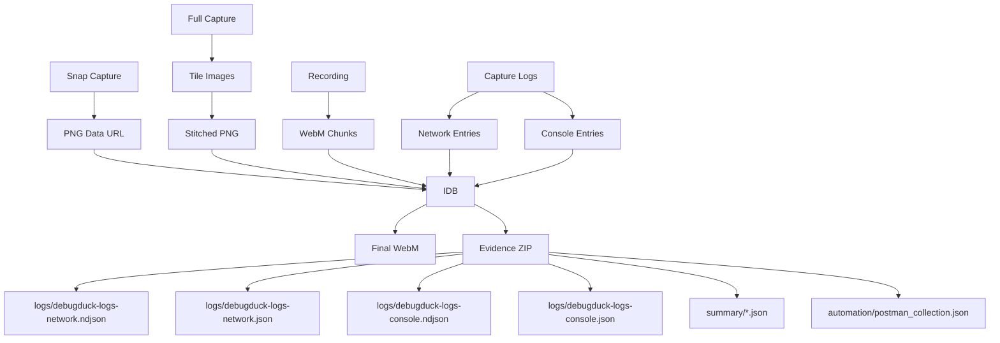

# DebugDuck V1 Architecture

DebugDuck is a local-only MV3 Chrome extension for QA capture and automation handoff.
It supports Snap and Full-page screenshots, detached-window tab recording,
network/console logs, structured evidence export, and Postman collection export.

This document contains multiple diagrams for engineering discussion and onboarding.

## System Context Diagram

```mermaid
graph TD
  User[User] --> Popup[DebugDuck Popup UI]
  User --> RecWin[Detached Recording Window]
  User --> Viewer[Screenshot Viewer/Editor]
  User --> LogsUI[Logs Control UI]

  subgraph Chrome Extension (MV3)
    Popup --> SW[Service Worker]
    RecWin --> SW
    Viewer --> SW
    LogsUI --> SW
    SW --> Offscreen[Offscreen Document]
    SW --> ContentScripts[Content Scripts]
    SW --> IDB[(IndexedDB)]
    SW --> Broker[Download Broker]
  end

  User --> Tab[Browser Tab]
  Tab --> WebApp[Target Web App]
  WebApp --> API[External APIs]

  ContentScripts --> Tab
  Offscreen --> Tab
  SW --> Tab

  IDB --> ZIP[Evidence ZIP]
  IDB --> WebM[Recording WebM]
  IDB --> PNG[Screenshots PNG]
  Broker --> ZIP
  Broker --> WebM
  Broker --> PNG
```

## Container / Component Diagram

```mermaid
graph LR
  subgraph UI Surfaces
    PopupUI[Main Popup]
    RecUI[Recording Window]
    LogsUI[Logs Control UI]
    ViewerUI[Screenshot Viewer/Editor]
  end

  subgraph Core Runtime
    SW[Service Worker]
    Offscreen[Recording Offscreen]
    CSFull[Full-page Capture Helper]
    CSLogs[Logs Overlay Script (logs only)]
  end

  subgraph Storage
    IDB[(IndexedDB)]
  end

  subgraph Export
    ZipBuilder[ZIP Builder]
    Broker[Download Broker]
  end

  PopupUI --> SW
  RecUI --> SW
  LogsUI --> SW
  ViewerUI --> SW
  SW --> Offscreen
  SW --> CSFull
  SW --> CSLogs
  SW --> IDB
  SW --> ZipBuilder
  ZipBuilder --> Broker
```

## Sequence Diagram - Snap / Full Capture



## Sequence Diagram - Recording



## Sequence Diagram - Logs Capture



## Data Flow Diagram



## Export Artifact Diagram

```mermaid
graph TD
  ZIP[Evidence ZIP]
  ZIP --> Meta[meta/session.json]
  ZIP --> Env[meta/environment.json (if present)]
  ZIP --> ExportMeta[meta/export_metadata.json (if present)]
  ZIP --> LogsND[logs/debugduck-logs-network.ndjson]
  ZIP --> LogsJSON[logs/debugduck-logs-network.json]
  ZIP --> ConsoleND[logs/debugduck-logs-console.ndjson]
  ZIP --> ConsoleJSON[logs/debugduck-logs-console.json]
  ZIP --> SummaryErrors[summary/errors.json]
  ZIP --> SummaryFailed[summary/failed_requests.json]
  ZIP --> SummarySession[summary/session_summary.json]
  ZIP --> SummaryTrunc[summary/truncation_report.json (if present)]
  ZIP --> Automation[automation/postman_collection.json]

  LogsND --> Automation
```

## Architecture Assumptions

- Recording controls are detached into a dedicated popup window and are not
  injected into the captured tab DOM.
- Full-page capture uses a content script to scroll and compute tiles; the final
  image is composed in the extension runtime and then opened in the viewer/export path.
- Logs export uses IndexedDB as the durable source of truth; network.ndjson is
  the raw canonical log, while network.json is the readable structured view.
- The download broker mediates ZIP and WebM file downloads using local blobs.

## V1 Frozen / Stable Areas

- Screenshot capture and full-page stitching pipeline.
- Recording engine (offscreen capture, chunk persistence, export).
- Logs capture pipeline and IndexedDB persistence.
- ZIP export structure, NDJSON/JSON logs, and Postman collection export.

## Export / Automation Bridge Extensions

- Postman collection export (automation/postman_collection.json) is derived
  from captured network entries (raw log data) and is an export-only bridge,
  not a capture system.
- Summary files are derived from logs and do not affect capture pipelines.
